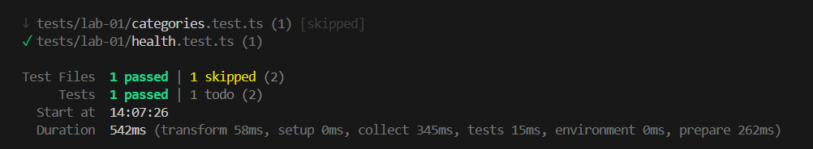
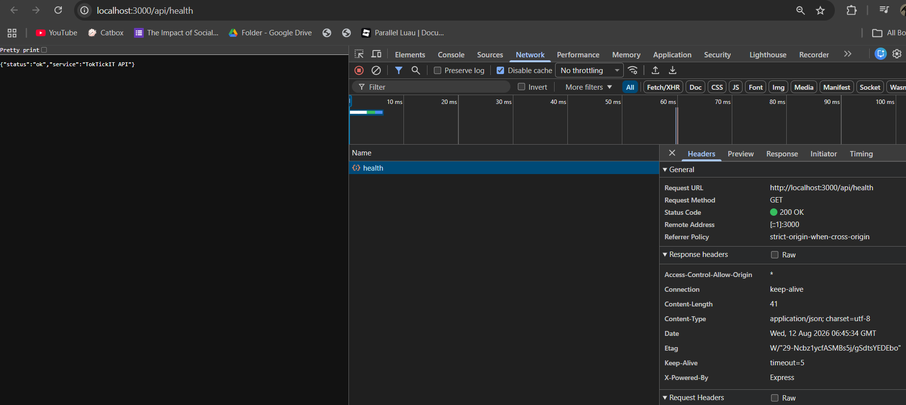

# Lab 1 — Test Plan and Evidence  (fill this in)

All test files live under server/tests/lab-01/ and client/tests/lab-01/.

| # | Tool | Test | Result |
|---|------|------|--------|
| 1 | Supertest | GET /api/health returns 200, status=ok | Passed |
| 2 | Supertest | GET /api/categories returns 4 seeded categories in id order | Passed |
| 3 | Vitest | Heading renders | Passed |
| 4 | Vitest | Success state shows Online + category list | Passed |
| 5 | Vitest | Error state shows Offline + message | Passed |

Paste your passing terminal output / screenshot below.

 ↓ tests/lab-01/categories.test.ts (1) [skipped]
 ✓ tests/lab-01/health.test.ts (1)

 Test Files  1 passed | 1 skipped (2)
      Tests  1 passed | 1 todo (2)
   Start at  14:07:26
   Duration  542ms (transform 58ms, setup 0ms, collect 345ms, tests 15ms, environment 0ms, prepare 262ms)

